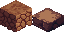

# Tile List Oct 23 2024
1. Dirt with Grass Top 
   - Color/Design Variants (7): 
	   - Green Forest Grass
	   - Flowery Green Forest Grass
	   - Yellow-Green Plains Grass
	   - Orange Dry Plains Grass
	   - Gray-Brown Petrified Grass
	   - Gray Burnt Grass
	   - Snow-Covered Mountain Grass
1. Dirt
	- Color/Design Variants (6):
		- Normal Dirt
		- Dry Dirt
		- Sandy Dirt
		- Gravel-Mixed Dirt
		- Gray Petrified Dirt
		- Shimmering Dirt
1. Sand
	- Color/Design Variants (5):
		- Normal Sand
		- Red-Orange Mesa Sand
		- Shell-Mixed Sand
		- Gravel-Mixed Sand
		- Star-Mixed Sand
1. Wood Log
	- Color/Design Variants (6):
		- Oak Log
		- Spruce Log
		- Sillwood Log
		- Ochrewood Log
		- TumTum Log
		- Green Stem 1
1. Wood Plank
	- Color/Design Variants (4):
		- Oak Plank
		- Spruce Plank
		- Sillwood Plank
		- TumTum Plank
1. Leaves
	- Color/Design Variants (4):
		- Oak Leaves
		- Spruce Needles
		- Blue Spruce Needles
		- TumTum Leaves
1. Natural Stone
	- Color/Design Variants (4):
		- Gray Stone
		- White Stone
		- Off-White Limestone
		- Dark Gray Rugged Stone
		- Red-Orange Mesa Stone
1. Cobbled Stone
	- Color/Design Variants (3):
		- Gray Cobbled Stone
		- Neat Cobbled Limestone
		- Mossy Gray Cobbled Stone
2. Chiseled Stone
	- Color/Design Variants (3):
		- Chiseled Gray Stone
		- Chiseled Off-White Limestone
		- Chiseled Dark Gray Stone
3. Snow
	- Color/Design Variants (2):
		- Normal Snow
		- Fluffy Snow
4. Domestic
	- Color/Design Variants ():
		- Hay Block
		- Wood Crate
		- Dirt Path in Grass
5. Nursery
	- Color/Design Variants (6):
		- Nursery Puzzle Tile
		- Purple/Black Nursery Pattern Tile
		- Gentle Wallpaper Block
		- Pink Ordered Tile
		- Yellow Ordered Tile
		- Light Blue Ordered Tile
6. Carpet
	- Color/Design Variants (3):
		- Normal Carpet
		- Fluffy Carpet
		- Royal Trim Carpet
