TTT Menu UI Concept
===================

# Pause Menu

### Concept Inspo Image 
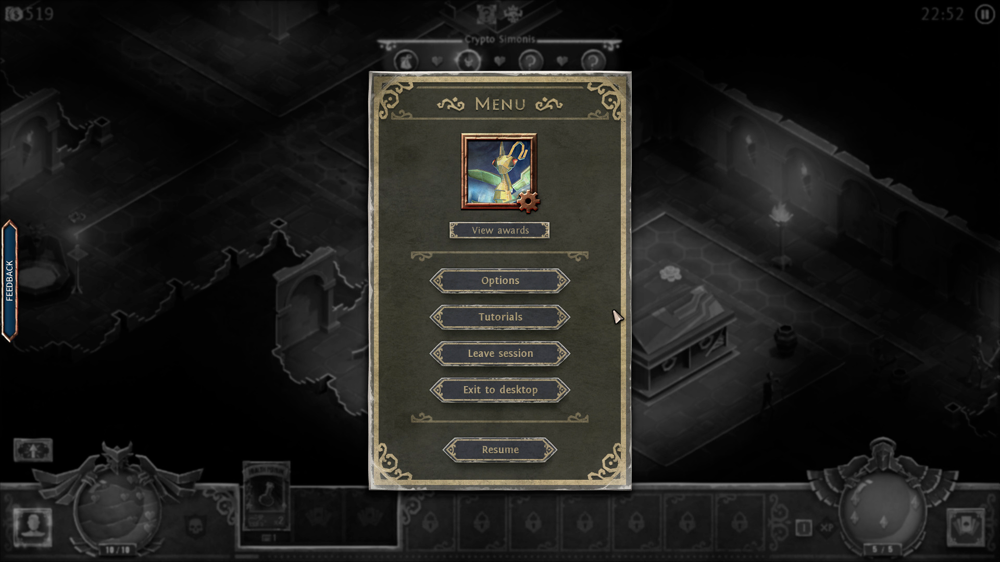

### Function Concept

- Simple vertically aligned button-based UI.

Buttons include:
- Game Resume
- Settings Adjustment
- Game Info
- Game Exit (To Menu)
- Menu Visual Mode Toggle Switch

### Visual Arrangement

- Menu background can be a standard rectangle shape.
- Buttons arranged vertically down the rectangle.
- Toggle Switch at bottom right corner of rectangle.

### Visual Style

- Soft metal gilding around inner border of rectangle, emphasized at corners.
- Buttons have similar, small gilded border around each.
- Crossed wand and sword at top of menu window.

### Added Visuals (Programmatic)

- Gentle filter overlay behind menu window, obscure game behind it slightly.

# Victory Menu

### Concept Inspo Images
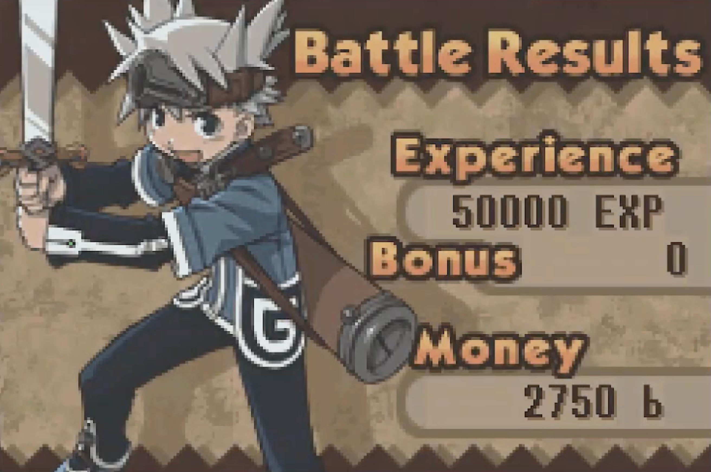

### Functional Concept

- Simple end battle-sequence window showing battle results and rewards.

Information Shown:
- Individual character sprites/portraits
- Exp gained by all characters
- Gold gained by team
- Icons of items plundered during and after battle.
- Portrait of party leader in stalwart pose?
- Title "Victory!" or some similar platitude.

### Visual Arrangement

- Right-aligned output results (final figures for exp, gold etc) (note to reconsider alignment in distant future)
- Vertically arranged results.
- Character sprite arrangement dependent on other design decisions, but horizontal rows or a single circle are likely to be ideal.
- Party leader portrait on left or center of window.

### Visual Style

- Style similar to other in-game, in-battle UI in terms of bordering, coloring etc.
- Battle result text could have a rounded, thick bubble border around them against a solid color background.
- All results and individual element background pieces can be set in front of a simple abstract pattern background (similar to image above).
- Gentle rounded border similar to inspo image.

# Dialogue

### Concept Inspo Images
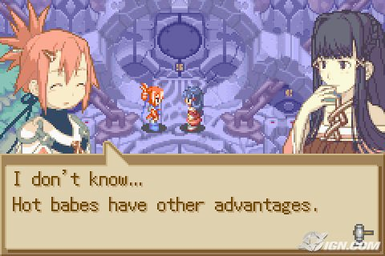
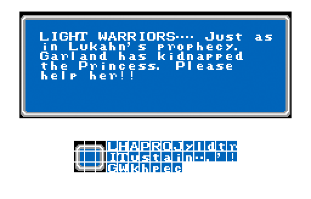
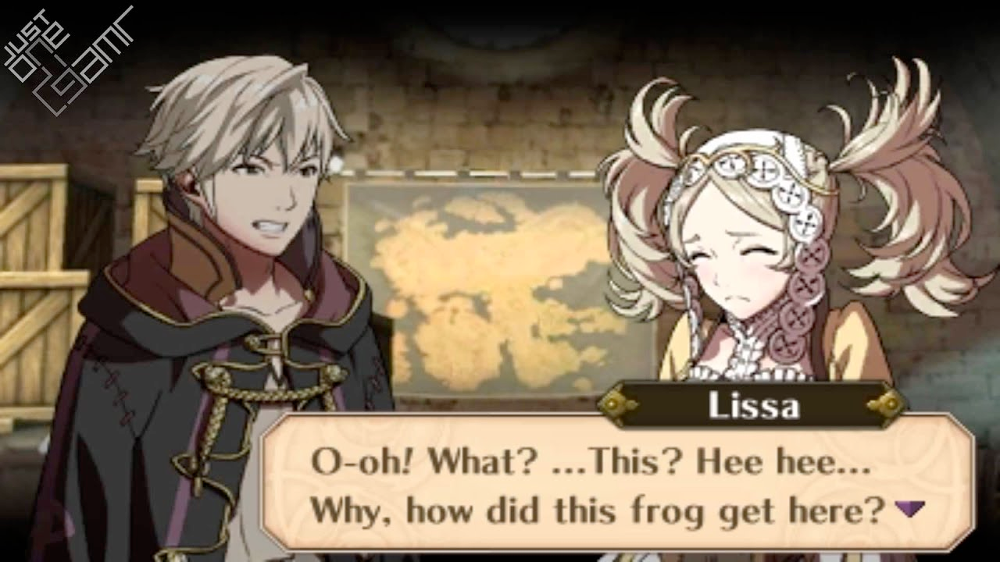

### Functional Concept

- Simple dialogue window detailing the name of the speaker and dialogue information.

Information Shown:
- Character Name
- Spoken text
- Dialogue choice buttons
- dialogue progression button

### Visual Arrangement

- Bordered box with aligned text inside
- Speaker name overlaid over box, vertical top.
- Dialogue progression button at the bottom right.
- Dialogue choice buttons presented vertically in smaller dialogue boxes.

### Visual Style

- Speaker name should be in it's own small bubble/box
- Simple border around larger dialogue box, preferably something similar to that shown in images.
- Visual style of dialogue is fine if significantly different from other UI.
- Backgrounds should be opaque.

# Shop

- TBA Not in Chapter 0

# Pre-Combat

### Concept Inspo Images
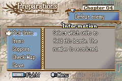
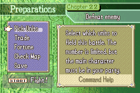
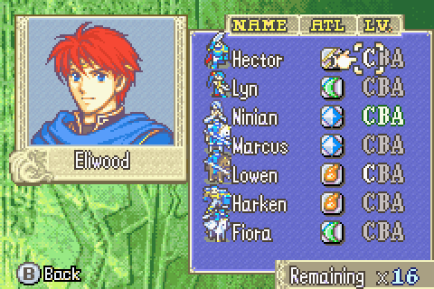
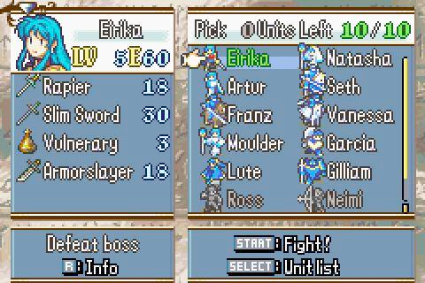

### Functional Concept

- Initial menu for pre-battle preparations

Options:
- Select Units
- View Battle Map
- Items
- Support
- Quit

# Collectibles

### Concept Inspo Images
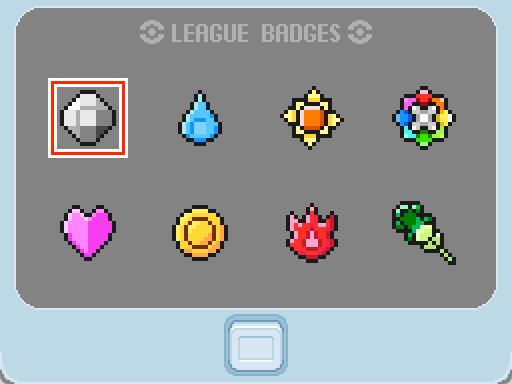
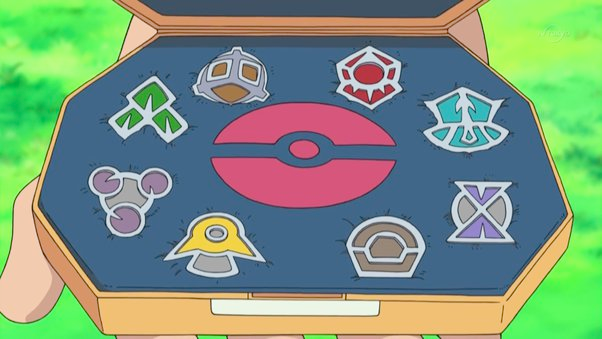

### Functional Concept

- Persistent visual record of milestones in game.

Information Shown:
- Images meant to depict collectible items gathered from traveling to various locations, namely libraries.

### Visual Arrangement

- Horizontally aligned icons against a background.

### Visual Style

- Abstract symbols representing locations or other significant imagery.
- Resemble metal badges in a carrying case.
- Titled with a qualifying title related to the collection group.
- Absent icons represented by darkened depression/shadow.

